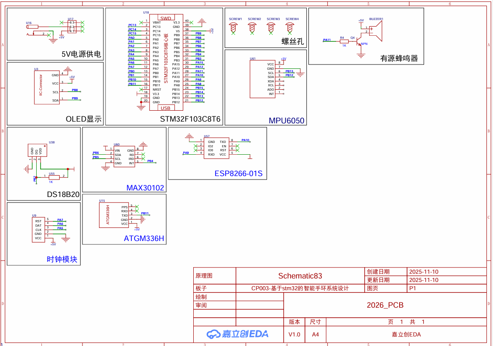

# Hypertension-Wearable-Health-System

This repository contains a prototype of an AI-assisted wearable health monitoring system designed for hypertension-related long-term health tracking.

The project started from a simple idea: ordinary smart bracelets can show current health data, but they are often weak in long-term record management and personalized health analysis. This prototype combines an STM32-based embedded device, ESP8266 Wi-Fi communication, an Android monitoring interface, MySQL-based historical data storage, and an AI health report module to explore a more complete health management workflow.

> Note: This project is a learning and prototyping project. The AI-generated report is only used for health trend summary and lifestyle suggestions. It does not replace professional medical diagnosis.

---

## 1. System Overview

The system is built around an STM32F103C8T6 microcontroller. The embedded device collects physiological and motion-related data from multiple sensor modules, displays key information locally through an OLED screen, and sends data through an ESP8266 Wi-Fi module.

The Android side is used for real-time data display, threshold setting, abnormal status checking, historical record viewing, and AI-assisted health report generation.

```text
Sensors
  ↓
STM32F103C8T6
  ↓
ESP8266 Wi-Fi Module
  ↓
MQTT / IoT Platform
  ↓
Android App
  ↓
MySQL Database
  ↓
AI Health Report
```

---

## 2. Hardware and PCB Schematic

The schematic was designed around the STM32F103C8T6 as the main controller. The board integrates several sensor and communication modules, including MAX30102, MPU6050, DS18B20, ESP8266-01S, ATGM336H GPS, OLED display, DS1302 clock module, buzzer, USB power input, and SWD debugging interface.



### Main Hardware Modules

| Module | Function | Interface / Connection |
|---|---|---|
| STM32F103C8T6 | Main control unit | Controls sensors, display, buzzer, and communication modules |
| MAX30102 | Heart rate and SpO2 detection | I2C communication |
| MPU6050 | Motion, posture, step counting, and fall detection | I2C communication |
| DS18B20 | Temperature measurement | One-Wire communication |
| OLED display | Local display of system status and health data | I2C communication |
| ESP8266-01S | Wi-Fi communication module | UART communication with STM32 |
| ATGM336H | GPS positioning module | UART communication |
| DS1302 | Real-time clock module | Clock/data/control pins |
| Buzzer | Local abnormal status reminder | GPIO control |
| SWD | Program download and debugging | SWDIO / SWCLK |
| USB Mini-B | Power input and debugging support | 5V input |

### Communication Design

The hardware communication is divided into several layers:

- **I2C bus** is used for modules such as MAX30102, MPU6050, and OLED display.
- **UART** is used for communication between STM32 and ESP8266 / GPS module.
- **One-Wire** is used for DS18B20 temperature measurement.
- **GPIO** is used for local alert modules such as the buzzer.
- **SWD** is used for programming and debugging the STM32.

This structure reduces wiring complexity while keeping each module functionally independent.

---

## 3. Main Functions

### Embedded Device Side

- Heart rate and SpO2 detection based on MAX30102
- Motion state and step counting based on MPU6050
- Fall detection using acceleration and gyroscope data
- Temperature measurement using DS18B20
- Local OLED display for key health data
- Buzzer reminder for abnormal status
- ESP8266-based Wi-Fi communication
- JSON-based data packaging for health data transmission

### Mobile and Data Side

- Real-time health data display
- Historical record viewing
- Abnormal status checking
- Threshold setting
- Health trend visualization
- AI-assisted health report generation

---

## 4. Software Workflow

The STM32 firmware initializes GPIO, I2C, UART, timer, and other peripherals through STM32CubeMX and the HAL library. Sensor drivers are organized in the BSP layer, while the main logic is implemented in the Core application code.

A typical data flow is:

```text
Sensor data acquisition
  ↓
STM32 data processing
  ↓
OLED display / buzzer alert
  ↓
ESP8266 Wi-Fi transmission
  ↓
Android App data display
  ↓
MySQL historical storage
  ↓
AI report generation
```

---

## 5. Repository Structure

```text
Hypertension-Wearable-Health-System/
├── BSP/                 # Custom drivers for sensors and external modules
├── Core/                # Main STM32 application code and peripheral initialization
├── Drivers/             # STM32 HAL and CMSIS drivers
├── MDK-ARM/             # Keil MDK project files
├── Android_App/         # Extracted core Android App source code
├── AI_Report/           # AI prompt design and report generation logic
├── Docs/                # Project images and documentation
│   └── pcb_schematic.png
├── .gitignore
├── .mxproject
├── ESP8266.c
├── ESP8266.h
├── README.md
└── project.ioc
```

---

## 6. Technology Stack

### Embedded System

- STM32F103C8T6
- C language
- STM32 HAL Library
- STM32CubeMX
- Keil MDK-ARM
- I2C / UART / GPIO / One-Wire
- ESP8266 Wi-Fi module
- MAX30102 / MPU6050 / DS18B20 / OLED

### App and Data

- Android Studio
- Java
- MQTT / JSON
- MySQL
- AI API integration

### AI Module

- Qwen / DashScope API
- Prompt-based health report generation
- Historical health data summary
- Abnormal trend reminder
- Lifestyle suggestion generation

---

## 7. Current Status

This repository currently includes:

- STM32 embedded firmware project
- Hardware schematic image
- Core Android App source code extracted from the project document
- AI report generation logic and prompt design
- Project configuration files for STM32CubeMX and Keil MDK

Some parts of the mobile application and database connection are prototype-level implementations. Sensitive information such as API keys, database passwords, MQTT credentials, and Wi-Fi passwords should not be uploaded to this repository.

---

## 8. Disclaimer

This project is intended for learning, embedded system integration, and prototype validation. The health analysis output is only for reference and should not be used as medical diagnosis or treatment advice.
